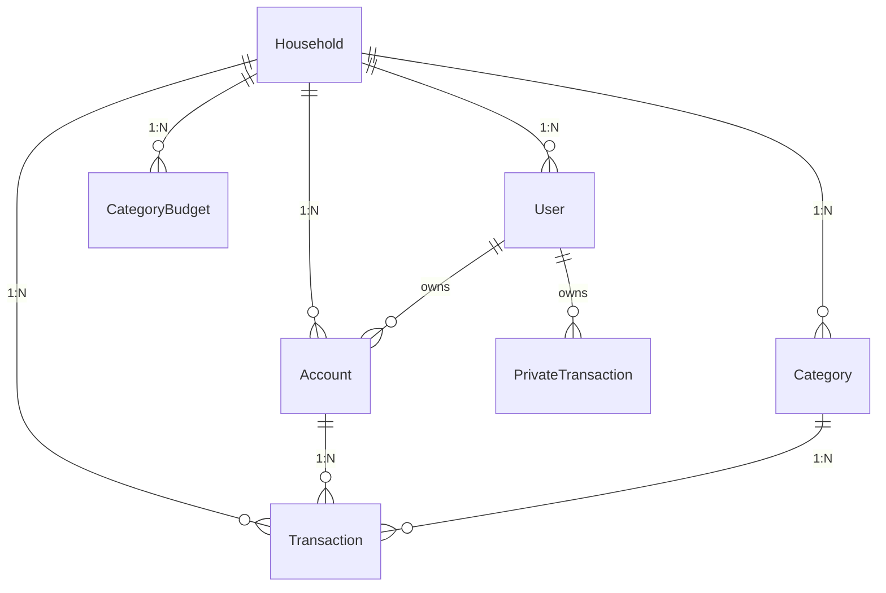

# NestWise

A comprehensive budgeting application designed for couples and shared households to coordinate their finances effectively while maintaining privacy controls for individual transactions.

## 📚 Documentation

This repository contains complete product and technical documentation split across multiple focused documents:

- **[Product Overview](docs/product.md)** - Product vision, features, user flows, and value proposition
- **[Technical Architecture](docs/architecture.md)** - System design, technology stack, and data models
- **[API Design Guide](docs/api.md)** - Complete API reference with examples and conventions
- **[Local Development Setup](docs/setup.md)** - Step-by-step development environment setup
- **[Self-Hosting Guide](docs/self-hosting.md)** - Production deployment guide (coming soon)

## 🚀 Quick Start

### Prerequisites

- **Node.js**: v22.12.0+ (or v20.19.5 with warnings)
- **pnpm**: v10.11.1
- **Docker**: For PostgreSQL, Redis, and management tools

### Install and Run

```bash
# Install pnpm globally
npm install -g pnpm@10.11.1

# Install dependencies (allow 3+ minutes)
pnpm install

# Start external services
docker compose up -d

# Copy environment files
cp apps/core-api/.env.example apps/core-api/.env
cp apps/web/.env.example apps/web/.env

# IMPORTANT: Set dummy API key in apps/core-api/.env
echo "RESEND_API_KEY=dummy-key-for-dev" >> apps/core-api/.env

# Start backend API (localhost:8080)
pnpm --filter @nest-wise/core-api start:debug

# Start frontend (localhost:5173) - in another terminal
pnpm --filter @nest-wise/web dev
```

### Verify Setup

- **API Health**: `curl http://localhost:8080/` → "Hello World!"
- **Web App**: `curl http://localhost:5173/` → HTML with "NestWise"
- **API Docs**: http://localhost:8080/swagger

## 🏗️ Project Structure

```
nest-wise/
├── apps/
│   ├── core-api/          # NestJS backend API (port 8080)
│   └── web/               # React + Vite frontend (port 5173)
├── packages/
│   └── contracts/         # Shared TypeScript types and DTOs
├── tooling/
│   ├── eslint/           # Shared ESLint configuration
│   └── typescript/       # Shared TypeScript configuration
└── docs/                 # Comprehensive documentation
```

## 🛠️ Technology Stack

### Backend

- **NestJS 11** with TypeScript 5.8
- **PostgreSQL** with TypeORM
- **Redis** with BullMQ for queues
- **JWT** authentication with cookies
- **Zod** validation via custom pipe
- **Swagger** auto-generated documentation

### Frontend

- **React 19** with TypeScript 5.8
- **Vite 6** for development and builds
- **TailwindCSS 4** for styling
- **React Query** for data fetching
- **React Router** with generated route tree

### Shared

- **Turborepo 2.5** for monorepo orchestration
- **pnpm workspaces** for dependency management
- **ESLint 9** and **Prettier** for code quality

## 💡 Key Features

### Financial Management

- **Households**: Shared financial context for couples/families
- **Accounts**: Multiple account tracking with real-time balances
- **Transactions**: Full CRUD with advanced filtering and search
- **Categories**: Organize spending for budgets and analytics
- **Private Transactions**: User-scoped transactions for privacy

### Planning & Insights

- **Category Budgets**: Monthly budget limits with progress tracking
- **Savings Tracking**: Automated savings calculations and trends
- **Reports**: Net worth trends, spending analysis, account summaries
- **AI Assistance**: Transaction categorization suggestions

### Collaboration

- **Multi-User**: Invite partners/roommates to shared household
- **Privacy Controls**: Balance transparency with personal privacy
- **Role-Based Access**: Policy-driven authorization for sensitive operations

## 🎯 Target Users & Use Cases

**Primary Users**: Couples managing shared finances
**Secondary Users**: Roommates, family members coordinating expenses

**Core User Flows**:

1. **Onboarding**: Setup household, accounts, categories, budgets
2. **Daily Management**: Add transactions, categorize, review balances
3. **Planning**: Set budgets, track progress, analyze spending
4. **Collaboration**: Invite partners, coordinate shared expenses

## 📋 Development Commands

```bash
# Build all packages (~50s)
pnpm build

# Lint all code (~32s)
pnpm lint

# Format code
pnpm format

# Individual package commands
pnpm --filter @nest-wise/core-api <command>
pnpm --filter @nest-wise/web <command>
pnpm --filter @nest-wise/contracts <command>
```

## 🌐 Development Services

| Service      | URL                           | Credentials           |
| ------------ | ----------------------------- | --------------------- |
| Backend API  | http://localhost:8080         | -                     |
| Frontend     | http://localhost:5173         | -                     |
| Swagger Docs | http://localhost:8080/swagger | -                     |
| PostgreSQL   | localhost:5432                | root/root             |
| PgAdmin      | http://localhost:5050         | admin@admin.com/admin |
| Redis        | localhost:6379                | -                     |
| RedisInsight | http://localhost:5540         | -                     |

## 🏛️ Data Model Overview



## 🔐 API Design Principles

- **RESTful**: Standard HTTP methods and status codes
- **Filtered**: Query parameters with advanced operators (`_gt`, `_gte`, `_like`, etc.)
- **Paginated**: Consistent pagination with `page`/`pageSize` and metadata
- **Versioned**: URI versioning (`/v1/...`)
- **Documented**: Interactive Swagger documentation
- **Secure**: JWT cookies, CORS, rate limiting, input validation

## 🤝 Contributing

1. **Setup**: Follow the [Local Development Setup](docs/setup.md) guide
2. **Architecture**: Review [Technical Architecture](docs/architecture.md)
3. **API**: Understand patterns in [API Design Guide](docs/api.md)
4. **Changes**: Make focused, well-tested changes
5. **Validation**: Run `pnpm lint && pnpm build` before commits

## 📖 Key Files Reference

- **Backend Entry**: [`apps/core-api/src/main.ts`](apps/core-api/src/main.ts)
- **Backend Modules**: [`apps/core-api/src/app.module.ts`](apps/core-api/src/app.module.ts)
- **Frontend Entry**: [`apps/web/src/main.tsx`](apps/web/src/main.tsx)
- **Shared Types**: [`packages/contracts/src/index.ts`](packages/contracts/src/index.ts)
- **Build Config**: [`turbo.json`](turbo.json)
- **Environment**: [`docker-compose.yml`](docker-compose.yml)

---

**Need Help?** Check the detailed documentation in the [`docs/`](docs/) directory or review the interactive API documentation at http://localhost:8080/swagger when running locally.
