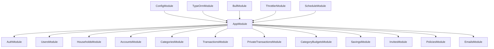
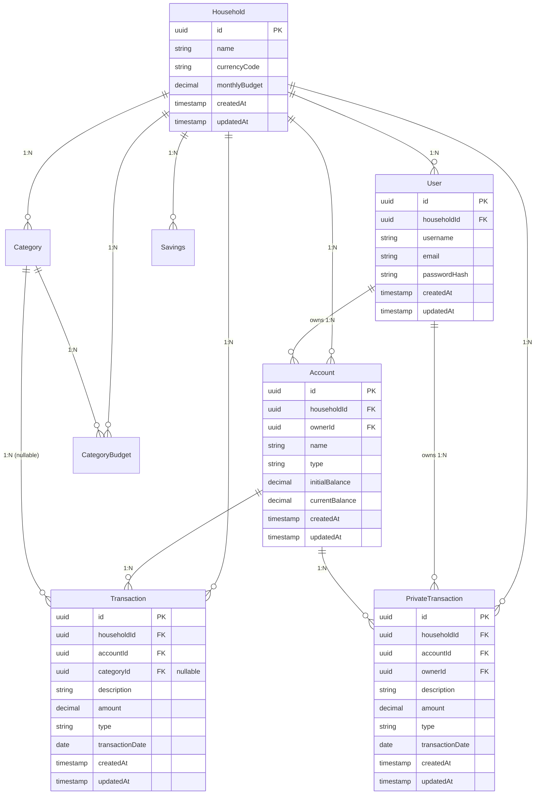

# Technical Architecture

## Monorepo Layout

The NestWise project uses a Turborepo-based monorepo structure to organize applications and shared packages:

```
nest-wise/
├── apps/
│   ├── core-api/          # NestJS backend API (port 8080)
│   └── web/               # React + Vite frontend (port 5173)
├── packages/
│   └── contracts/         # Shared TypeScript types and DTOs
├── tooling/
│   ├── eslint/           # Shared ESLint configuration
│   └── typescript/       # Shared TypeScript configuration
├── docker-compose.yml    # PostgreSQL, Redis, PgAdmin, RedisInsight
├── turbo.json           # Build pipeline configuration
└── pnpm-workspace.yaml  # Workspace definitions
```

## Technology Stack

### Backend (`apps/core-api`)

- **Framework**: NestJS 11 with TypeScript 5.8
- **Database**: PostgreSQL with TypeORM
- **Cache/Queues**: Redis with BullMQ
- **Validation**: Zod schemas via custom `ZodValidationPipe`
- **Authentication**: JWT with cookie-based storage
- **Documentation**: Swagger/OpenAPI auto-generated
- **Security**: Helmet, CORS, throttling
- **Logging**: pino-nestjs with pretty formatting in development

### Frontend (`apps/web`)

- **Framework**: React 19 with TypeScript 5.8
- **Build Tool**: Vite 6
- **Styling**: TailwindCSS 4
- **Data Fetching**: React Query with ky HTTP client
- **Routing**: React Router with generated route tree
- **State Management**: React Query for server state, React hooks for local state

### Shared (`packages/contracts`)

- **Purpose**: Shared TypeScript contracts, DTOs, and Zod schemas
- **Usage**: Consumed by both backend validation and frontend type safety
- **Build**: TypeScript compilation with both CJS and ESM outputs

### Build System

- **Monorepo**: Turborepo 2.5 for orchestrated builds and caching
- **Package Manager**: pnpm v10.11.1 with workspaces
- **Development**: ESLint 9, Prettier, Husky pre-commit hooks

## Backend Architecture (`apps/core-api`)

### Entry Points and Configuration

- **`src/main.ts`**: Application bootstrap with versioning, security, CORS, and Swagger setup
- **`src/app.module.ts`**: Root module registering all feature modules
- **`src/config/*`**: Configuration modules for app, database, queues, and throttling

### Module Structure



### Core Modules

- **`auth`**: Authentication, login, setup, JWT management
- **`users`**: User management and registration
- **`households`**: Household CRUD and member management
- **`accounts`**: Financial account management and transfers
- **`categories`**: Transaction categorization
- **`transactions`**: Main transaction management with filtering/search
- **`private-transactions`**: User-scoped private transactions
- **`category-budgets`**: Monthly budget management per category
- **`savings`**: Savings calculations and trend reporting
- **`invites`**: Household member invitation system
- **`policies`**: Authorization logic for sensitive operations
- **`emails`**: Email sending service integration

### Supporting Infrastructure

- **`src/common`**: Guards (`AuthGuard`), decorators (`@CurrentUser()`), enums, interfaces
- **`src/lib`**: Utilities like hashing and custom validation pipes
- **`src/tools/swagger`**: OpenAPI DTOs and documentation setup

### Data Model and Relations



### Service and Repository Pattern

- **Services**: Encapsulate business logic and coordinate between repositories and policies
- **Repositories**: Wrap TypeORM queries with household-scoped helpers and complex query builders
- **Policies**: Centralized authorization logic called before sensitive operations

### Validation and Type Safety

- **Zod Integration**: Custom `ZodValidationPipe` validates all inputs using schemas from `@nest-wise/contracts`
- **DTO Ownership**: All DTOs and schemas defined in shared contracts package
- **Type Safety**: End-to-end TypeScript type safety from frontend to database

### Authentication and Authorization

- **JWT Authentication**: Token-based auth with httpOnly cookies
- **AuthGuard**: Protects routes requiring authentication
- **@CurrentUser()**: Decorator providing JWT payload in controllers
- **Policies Module**: Handles authorization decisions for resource access

### API Features

- **Versioning**: URI versioning enabled (e.g., `/v1/...`)
- **Swagger Documentation**: Auto-generated OpenAPI docs at `/swagger`
- **CORS**: Configured for `http://localhost:5173` with credentials
- **Rate Limiting**: Configurable throttling via NestJS throttler
- **Logging**: Structured logging with pino-nestjs

## Frontend Architecture (`apps/web`)

### Application Structure

```
src/
├── app/                 # App-level configuration
├── components/         # Reusable UI components
├── hooks/             # Custom React hooks
├── lib/               # Utility functions and configurations
├── modules/           # Feature-based organization
│   ├── api/          # API client modules
│   └── [feature]/    # Feature-specific components and logic
├── routes/           # React Router route components
├── assets/          # Static assets
└── common/          # Shared types and utilities
```

### Key Technologies

- **React 19**: Latest React with concurrent features
- **Vite 6**: Fast development and optimized production builds
- **TailwindCSS 4**: Utility-first styling with design system
- **React Query**: Server state management with caching and synchronization
- **React Router**: File-based routing with generated route tree

### Data Fetching and API Integration

- **HTTP Client**: `ky` configured with base URL and credentials
- **API Modules**: `src/modules/api/*.ts` consuming `@nest-wise/contracts` types
- **Error Handling**: Automatic redirect to `/login` on 401/403 for authenticated routes
- **Type Safety**: Full TypeScript integration with backend contracts

### Routing Structure

Generated route tree supports the following main areas:

- **Public Routes**: `/login`, `/setup`, `/invites`
- **Authenticated Routes**: `/accounts`, `/transactions`, `/analytics`, `/members`, `/my-finances`, `/plan`
- **Reports**: `/reports/net-worth`, `/reports/savings`, `/reports/spending`

### State Management

- **Server State**: React Query for API data with caching, background updates, and optimistic updates
- **Local State**: React hooks (`useState`, `useReducer`) for component-level state
- **Form State**: React Hook Form for form management and validation

## Shared Contracts (`packages/contracts`)

### Purpose and Integration

The contracts package ensures type safety and consistency across the entire application:

- **DTO Definitions**: All request/response types shared between frontend and backend
- **Zod Schemas**: Validation schemas used by backend `ZodValidationPipe`
- **Type Safety**: Compile-time guarantees that frontend and backend agree on data structures
- **Single Source of Truth**: Prevents drift between frontend and backend expectations

### Build and Distribution

- **Build Tool**: `tsup` generating both CJS and ESM outputs
- **TypeScript**: Compiled with declaration files for full type information
- **Development**: Watch mode for real-time updates during development

## Configuration and Environments

### Environment Variables

#### Backend (`apps/core-api/.env`)

- **APP_PORT**: Server port (default: 8080)
- **APP_URL**: Backend URL for CORS and links
- **WEB_APP_URL**: Frontend URL for CORS configuration
- **JWT_SECRET**: Secret for JWT token signing
- **DB\_\***: PostgreSQL connection settings
- **REDIS\_\***: Redis connection for caches and queues
- **RESEND_API_KEY**: Email service API key (required, use dummy value for dev)
- **OPENAI_API_KEY**: AI categorization service (optional)

#### Frontend (`apps/web/.env`)

- **VITE_API_URL**: Backend API URL (default: http://localhost:8080)

### External Services and Ports

- **Backend API**: http://localhost:8080
- **Frontend**: http://localhost:5173
- **PostgreSQL**: localhost:5432 (user: root, password: root, db: nestwise_dev)
- **Redis**: localhost:6379
- **PgAdmin**: http://localhost:5050 (admin@admin.com / admin)
- **RedisInsight**: http://localhost:5540
- **Swagger Documentation**: http://localhost:8080/swagger

## Security and Policies

### Authentication Flow

1. User login/setup creates JWT token
2. Token stored in httpOnly cookie for security
3. All API requests include cookie automatically
4. Backend validates JWT on protected routes

### Authorization

- **Policies Module**: Centralized authorization logic
- **Resource-based**: Policies validate access to specific resources (accounts, transactions)
- **Household-scoped**: Most operations limited to user's household context

### Security Features

- **Helmet**: Security headers and protection
- **CORS**: Configured for specific frontend origin with credentials
- **Rate Limiting**: Configurable throttling to prevent abuse
- **Input Validation**: All inputs validated via Zod schemas
- **SQL Injection Prevention**: TypeORM query builder and parameterized queries
